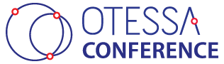

# Welcome {.unnumbered}

**All times are Eastern Daylight Time**

**Current time in Montréal (UTC-04:00 | Click for more info)**

<iframe src="https://free.timeanddate.com/clock/i98z8zgl/n165/fs18/tcccc/ftbi/tt0/tw1/tm1/ta1" frameborder="0" width="347" height="23">
</iframe>

 

::: {.callout-important}
[Check the OTESSA conference website for abstracts](https://otessa.org/2024/program) and any changes to this program. 

Information about any changes to the program will also be available via the OTESSA Welcome Desk on the conference platform once the conference opens.

:::

All OTESSA Participants can attend the [Congress “Big Thinking” lecture series](https://www.federationhss.ca/en/programs-policy/big-thinking). These take place each day of the conference. Congress has “[open events](https://www.federationhss.ca/en/congress/programming-events/events-calendar)” available as well (open to registrants across association conferences at Congress as well as those who hold community passes).

All OTESSA Registrants can also attend conference sessions offered by the [Canadian Association for the Study of Education (CSSE)](https://csse-scee.ca/), [Canadian Association for the Study of Higher Education (CSSHE)](https://csshe-scees.ca/), and [Canadian Association of Learned Journals (CALJ)](https://www.calj-acrs.ca/) as we have reciprocity agreements in place. Please note that presenters must register in each conference in which they are presenting.

<!--

## June 12-15 \@ McGill University

+--------------------+------------------------------------------------------------+-------------+--------------+
| Time               | Event                                                      | Location    | Notes        |
+====================+============================================================+=============+==============+
| 8:00 - 9:00 am EDT | **Continental Breakfast Provided**                         |             |              |
+--------------------+------------------------------------------------------------+-------------+--------------+
| 8:00 am - 11:30 pm | Welcome Desk Open                                          |             |              |
+--------------------+------------------------------------------------------------+-------------+--------------+
| 9:00 am - 9:15 am  | Conference Welcome, Announcements and LAnd Acknowledgement |             | LINK         |
+--------------------+------------------------------------------------------------+-------------+--------------+
| 9:30 am - 10:30 pm | Concurrent Sessions                                        |             | LINK - Jun12 |
|                    |                                                            |             |              |
|                    |                                                            |             | LINK - Jun13 |
|                    |                                                            |             |              |
|                    |                                                            |             | LINK - Jun14 |
|                    |                                                            |             |              |
|                    |                                                            |             | LINK - Jun15 |
+--------------------+------------------------------------------------------------+-------------+--------------+
| 10:30 - 11:00 am   | Break                                                      |             |              |
+--------------------+------------------------------------------------------------+-------------+--------------+
| 11:00 - 12:00 pm   | Concurrent Sessions                                        |             | LINK - Jun12 |
|                    |                                                            |             |              |
|                    |                                                            |             | LINK - Jun13 |
|                    |                                                            |             |              |
|                    |                                                            |             | LINK - Jun14 |
|                    |                                                            |             |              |
|                    |                                                            |             | LINK - Jun15 |
+--------------------+------------------------------------------------------------+-------------+--------------+
| 12:00 - 1:30 pm    | Break                                                      |             |              |
+--------------------+------------------------------------------------------------+-------------+--------------+
| 1:30 - 2:30 pm     | Keynotes or Unconferences                                  |             | LINK - Jun12 |
|                    |                                                            |             |              |
|                    |                                                            |             | LINK - Jun13 |
|                    |                                                            |             |              |
|                    |                                                            |             | LINK - Jun14 |
|                    |                                                            |             |              |
|                    |                                                            |             | LINK - Jun15 |
+--------------------+------------------------------------------------------------+-------------+--------------+
| 2:30 - 3:00 pm     | Break                                                      |             |              |
+--------------------+------------------------------------------------------------+-------------+--------------+
| 3:00 - 3:45 pm     | Concurrent Sessions                                        |             | LINK - Jun12 |
|                    |                                                            |             |              |
|                    |                                                            |             | LINK - Jun13 |
|                    |                                                            |             |              |
|                    |                                                            |             | LINK - Jun14 |
|                    |                                                            |             |              |
|                    |                                                            |             | LINK - Jun15 |
+--------------------+------------------------------------------------------------+-------------+--------------+
|                    | Discussion/Networking Pods                                 |             |              |
+--------------------+------------------------------------------------------------+-------------+--------------+
|                    | Congress Events                                            |             | LINK         |
+--------------------+------------------------------------------------------------+-------------+--------------+
|                    | OTESSA Social                                              |             |              |
+--------------------+------------------------------------------------------------+-------------+--------------+
-->